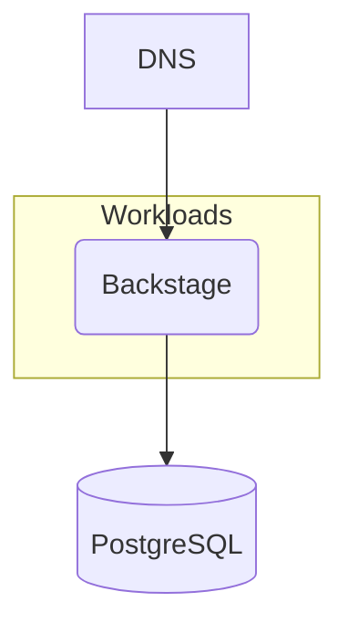

## Overview

In this example we will walk you through how you can deploy a containerized Backstage application using a PostgreSQL database, and this with both `score-compose` and `score-k8s`.



## Score file

Open your IDE and paste in the following `score.yaml` file, which describes a simple web server exposed via a DNS that queries a PostgreSQL database on each request. The demo code can be found [here](https://github.com/mathieu-benoit/deploy-backstage-with-score).

```yaml
apiVersion: score.dev/v1b1
metadata:
  name: backstage
containers:
  backstage:
    image: .
    command:
      - "node"
    args:
      - packages/backend
      - "--config"
      - app-config.yaml
      - "--config"
      - app-config.production.yaml
    variables:
      POSTGRES_HOST: ${resources.pg.host}
      POSTGRES_PASSWORD: ${resources.pg.password}
      POSTGRES_PORT: ${resources.pg.port}
      POSTGRES_USER: ${resources.pg.username}
      APP_CONFIG_auth_providers_guest_dangerouslyAllowOutsideDevelopment: "true"
      APP_CONFIG_app_baseUrl: ${resources.dns.url}
      APP_CONFIG_backend_baseUrl: ${resources.dns.url}
      APP_CONFIG_backend_cors_origin: ${resources.dns.url}
service:
  ports:
    tcp:
      port: 7007
      targetPort: 7007
resources:
  pg:
    type: postgres-instance
  dns:
    type: dns
  route:
    type: route
    params:
      host: ${resources.dns.host}
      path: /
      port: 7007
```

## Deployment with `score-compose` and `score-k8s`

From here, we will now see how to deploy this exact same Score file with either with `score-compose` or with `score-k8s`:






## Next steps

- [**Deep dive with the associated step-by-step guide**](https://medium.com/@mabenoit/deploy-backstage-with-score-45bb2d7c2d90): Go through the associated step-by-step guide to understand the different concepts with both: Backstage and Score.
- [**Explore more examples**](/docs/examples/): Check out more examples to dive into further use cases and experiment with different configurations.
- [**Join the Score community**](): Connect with fellow Score developers on our CNCF Slack channel or start find your way to contribute to Score.
