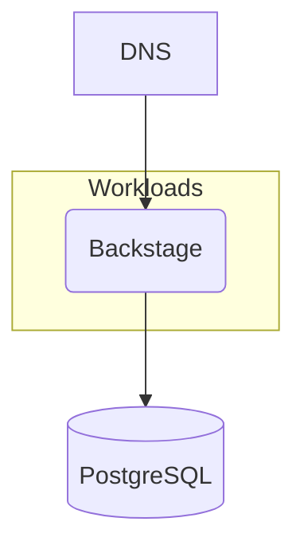

## Overview

In this example we will walk you through how you can deploy a Backstage containerized application using a PostgreSQL database, and this with both `score-compose` and `score-k8s`.



## 1. `score.yaml`

Open your IDE and paste in the following `score.yaml` file, which describes a simple web server exposed via a DNS that queries a PostgreSQL database on each request. The demo code can be found [here](https://github.com/mathieu-benoit/deploy-backstage-with-score).

```yaml
apiVersion: score.dev/v1b1
metadata:
  name: backstage
containers:
  backstage:
    image: .
    command:
      - "node"
    args:
      - packages/backend
      - "--config"
      - app-config.yaml
      - "--config"
      - app-config.production.yaml
    variables:
      POSTGRES_HOST: ${resources.pg.host}
      POSTGRES_PASSWORD: ${resources.pg.password}
      POSTGRES_PORT: ${resources.pg.port}
      POSTGRES_USER: ${resources.pg.username}
      APP_CONFIG_auth_providers_guest_dangerouslyAllowOutsideDevelopment: "true"
      APP_CONFIG_app_baseUrl: ${resources.dns.url}
      APP_CONFIG_backend_baseUrl: ${resources.dns.url}
      APP_CONFIG_backend_cors_origin: ${resources.dns.url}
service:
  ports:
    tcp:
      port: 7007
      targetPort: 7007
resources:
  pg:
    type: postgres-instance
  dns:
    type: dns
  route:
    type: route
    params:
      host: ${resources.dns.host}
      path: /
      port: 7007
```

From here, we will now see how you can deploy this exact same Score file:

- Either with [`score-compose`](#2-score-compose)
- Or with [`score-k8s`](#3-score-k8s)

## 2. `score-compose`

To begin, follow the [installation instructions](/docs/score-implementation/score-compose/installation) to install the latest version of `score-compose`.

### `init`

Initialize your current `score-compose` workspace, run the following command in your terminal:

```bash
score-compose init --no-sample \
    --provisioners https://raw.githubusercontent.com/score-spec/community-provisioners/refs/heads/main/dns/score-compose/10-dns-with-url.provisioners.yaml
```

The `init` command will create the `.score-compose` directory with the [default resource provisioners]() available. We are also importing one external file to support the `dns` dependencies: [`dns` provisioner](https://github.com/score-spec/community-provisioners/blob/main/service/score-compose/10-dns-with-url.provisioners.yaml).

You can see the resource provisioners available by running this command:

```bash
score-compose provisioners list
```

The Score file example illustrated uses three resource types: `postgres-instance`, `dns` and `route`.

```none
+-------------------+-------+------------------+--------------------------------+---------------------------------+
|     TYPE          | CLASS |      PARAMS      |            OUTPUTS             |          DESCRIPTION            |
+-------------------+-------+------------------+--------------------------------+---------------------------------+
| dns               | (any) |                  | host, url                      | Outputs a *.localhost domain as |
|                   |       |                  |                                | the hostname and associated URL |
|                   |       |                  |                                | in http on port 8080            |
+-------------------+-------+------------------+--------------------------------+---------------------------------+
| postgres-instance | (any) |                  | host, password, port, username | Provisions a dedicated          |
|                   |       |                  |                                | PostgreSQL instance             |
+-------------------+-------+------------------+--------------------------------+---------------------------------+
| route             | (any) | host, path, port |                                | Provisions an Ingress route on  |
|                   |       |                  |                                | a shared Nginx instance         |
+-------------------+-------+------------------+--------------------------------+---------------------------------+
```

### `generate`

Convert the `score.yaml` file into a runnable `compose.yaml`, run the following command in your terminal:

```bash
score-compose generate score.yaml --image ghcr.io/mathieu-benoit/backstage:latest
```

The `generate` command will add the input `score.yaml` workload with a particular container image to the `.score-compose/state.yaml` state file and generate the output `compose.yaml`.

If you want to build the container image when this `compose.yaml` will be deployed, you can run this `generate` command with the `--build` parameter instead:

```bash
score-compose generate score.yaml --build 'main={"context":".","tags":["backstage:local"]}'
```

See the generated `compose.yaml` by running this command:

```bash
cat compose.yaml
```

If you make any modifications to the `score.yaml` file, run `score-compose generate score.yaml` to regenerate the output `compose.yaml`.

### `resources`

Get the information of the resources dependencies of the workload, run the following command:

```bash
score-compose resources list
```

```none
+----------------------------------------+--------------------------------+
|                  UID                   |            OUTPUTS             |
+----------------------------------------+--------------------------------+
| dns.default#backstage.dns              | host, url                      |
+----------------------------------------+--------------------------------+
| postgres-instance.default#backstage.pg | host, password, port, username |
+----------------------------------------+--------------------------------+
| route.default#backstage.route          |                                |
+----------------------------------------+--------------------------------+
```

At this stage, we can already see the value of the `dns` resource generated:

```bash
score-compose resources get-outputs dns.default#backstage.dns
```

```none
{
  "host": "dnsjdtv57.localhost",
  "url": "http://dnsjdtv57.localhost:8080"
}
```

Same for the `postgres-instance` resource:

```bash
score-compose resources get-outputs postgres-instance.default#backstage.pg
```

```none
{
  "host": "pg-OuoTNo",
  "password": "REDACTED",
  "port": 5432,
  "username": "REDACTED"
}
```

### `docker compose`

Run `docker compose up` to execute the generated `compose.yaml` file:

```bash
docker compose up -d
```

```none
[+] Running 4/4
 ✔ Container deploy-backstage-with-score-pg-OuoTNo-1            Healthy 
 ✔ Container deploy-backstage-with-score-wait-for-resources-1   Exited 
 ✔ Container deploy-backstage-with-score-routing-6uaxax-1       Started 
 ✔ Container deploy-backstage-with-score-backstage-backstage-1  Started
```

### `docker ps`

See the running containers:

```bash
docker ps
```

```none
CONTAINER ID   IMAGE                                     COMMAND                  CREATED       STATUS                                  PORTS                                              NAMES
9b2ff62333ff   ghcr.io/mathieu-benoit/backstage:latest   "node packages/backe…"   5 hours ago   Up 5 hours                                                                                 deploy-backstage-with-score-backstage-backstage-1
4b1203acbf41   mirror.gcr.io/postgres:17-alpine          "docker-entrypoint.s…"   5 hours ago   Up 5 hours (healthy)                    5432/tcp                                           deploy-backstage-with-score-pg-mwgmNx-1
716b626ad841   mirror.gcr.io/nginx:1-alpine              "/docker-entrypoint.…"   5 hours ago   Up 5 hours                              0.0.0.0:8080->80/tcp, [::]:8080->80/tcp            deploy-backstage-with-score-routing-idouo7-1
```

### `curl localhost:8080`

Test the running container, run the following command:

```bash
curl localhost:8080 -H "Host: dnsjdtv57.localhost"
```

```none
...
<title>Scaffolded Backstage App</title>
...
```

Congrats! You’ve successfully deploy, with the `score-compose` implementation, a sample Backstage containerized workload talking to PostgreSQL and exposed via a DNS. You provisioned them through Docker, without writing the Docker Compose file by yourself.

## 3. `score-k8s`

To begin, follow the [installation instructions](/docs/score-implementation/score-k8s/installation) to install the latest version of `score-k8s`.

### `init`

Initialize your current `score-k8s` workspace, run the following command in your terminal:

```bash
score-k8s init --no-sample \
    --provisioners https://raw.githubusercontent.com/score-spec/community-provisioners/refs/heads/main/dns/score-k8s/10-dns-with-url.provisioners.yaml
```

The `init` command will create the `.score-k8s` directory with the [default resource provisioners]() available. We are also importing one external file to support the `dns` dependencies: [`dns` provisioner](https://github.com/score-spec/community-provisioners/blob/main/service/score-k8s/10-dns-with-url.provisioners.yaml).

You can see the resource provisioners available by running this command:

```bash
score-k8s provisioners list
```

The Score file example illustrated uses three resource types: `postgres-instance`, `dns` and `route`.

```none
+-------------------+-------+------------------+--------------------------------+---------------------------------+
|     TYPE          | CLASS |      PARAMS      |            OUTPUTS             |          DESCRIPTION            |
+-------------------+-------+------------------+--------------------------------+---------------------------------+
| dns               | (any) |                  | host, url                      | Outputs a *.localhost domain as |
|                   |       |                  |                                | the hostname and associated URL |
|                   |       |                  |                                | in http on port 80              |
+-------------------+-------+------------------+--------------------------------+---------------------------------+
| postgres-instance | (any) |                  | host, password, port, username | Provisions a dedicated          |
|                   |       |                  |                                | PostgreSQL instance             |
+-------------------+-------+------------------+--------------------------------+---------------------------------+
| route             | (any) | host, path, port |                                | Provisions an Ingress route on  |
|                   |       |                  |                                | a shared Nginx instance         |
+-------------------+-------+------------------+--------------------------------+---------------------------------+
```

### `generate`

Convert the `score.yaml` file into a runnable `manifests.yaml`, run the following command in your terminal:

```bash
score-k8s generate score.yaml --image ghcr.io/mathieu-benoit/backstage:latest
```

The `generate` command will add the input `score.yaml` workload with a particular container image to the `.score-k8s/state.yaml` state file and generate the output `manifests.yaml`.

See the generated `manifests.yaml` by running this command:

```bash
cat manifests.yaml
```

If you make any modifications to the `score.yaml` file, run `score-k8s generate score.yaml` to regenerate the output `manifests.yaml`.

### `resources`

Get the information of the resources dependencies of the workload, run the following command:

```bash
score-k8s resources list
```

```none
+----------------------------------------+--------------------------------+
|              UID                       |            OUTPUTS             |
+----------------------------------------+--------------------------------+
| dns.default#backstage.dns              | host, url                      |
+----------------------------------------+--------------------------------+
| postgres-instance.default#backstage.pg | host, password, port, username |
+----------------------------------------+--------------------------------+
| route.default#backstage.route          |                                |
+----------------------------------------+--------------------------------+
```

At this stage, we can already see the value of the `dns` resource generated:

```bash
score-k8s resources get-outputs dns.default#backstage.dns
```

```none
{
  "host": "dnsnocrke.localhost",
  "url": "http://dnsnocrke.localhost:80"
}
```

Same for the `postgres-instance` resource:

```bash
score-k8s resources get-outputs postgres-instance.default#backstage.pg
```

```none
{
  "host": "pg-backstage-d7058793",
  "password": "REDACTED",
  "port": 5432,
  "username": "REDACTED"
}
```

### `kubectl apply`

_Here you will need to have access to a Kubernetes cluster to execute the following commands. You can follow [these instructions](/docs/how-to/score-k8s/kind-cluster/) if you want to set up a Kind cluster._

Run `kubectl apply` to execute the generated `manifests.yaml` file:

```bash
kubectl apply -f manifests.yaml
```

```none
secret/pg-backstage-d7058793 created
statefulset.apps/pg-backstage-d7058793 created
service/pg-backstage-d7058793 created
httproute.gateway.networking.k8s.io/route-backstage-76d19d47 created
service/backstage created
deployment.apps/backstage created
```

### `kubectl get all`

See the running containers:

```bash
kubectl get all,httproute
```

```none
NAME                             READY   STATUS    RESTARTS   AGE
pod/backstage-7667f68bf9-vnlw9   1/1     Running   0          37s
pod/pg-backstage-d7058793-0      1/1     Running   0          37s

NAME                            TYPE        CLUSTER-IP      EXTERNAL-IP   PORT(S)    AGE
service/backstage               ClusterIP   10.96.146.148   <none>        7007/TCP   37s
service/pg-backstage-d7058793   ClusterIP   10.96.21.104    <none>        5432/TCP   37s

NAME                        READY   UP-TO-DATE   AVAILABLE   AGE
deployment.apps/backstage   1/1     1            1           37s

NAME                                   DESIRED   CURRENT   READY   AGE
replicaset.apps/backstage-7667f68bf9   1         1         1       37s

NAME                                     READY   AGE
statefulset.apps/pg-backstage-d7058793   1/1     37s

NAME                                                           HOSTNAMES                 AGE
httproute.gateway.networking.k8s.io/route-backstage-76d19d47   ["dnsnocrke.localhost"]   37s
```

### `curl localhost`

Test the running container, run the following command:

```bash
curl localhost -H "Host: dnsnocrke.localhost"
```

```none
...
<title>Scaffolded Backstage App</title>
...
```

Congrats! You’ve successfully deploy, with the `score-k8s` implementation, a sample Backstage containerized workload talking to PostgreSQL and exposed via a DNS. You provisioned them through `kubectl`, without writing the Kubernetes manifests file by yourself.

## Next steps

- [**Deep dive with the associated step-by-step guide**](https://medium.com/@mabenoit/deploy-backstage-with-score-45bb2d7c2d90): Go through the associated step-by-step guide to understand the different concepts with both: Backstage and Score.
- [**Explore more examples**](/docs/examples/): Check out more examples to dive into further use cases and experiment with different configurations.
- [**Join the Score community**](): Connect with fellow Score developers on our CNCF Slack channel or start find your way to contribute to Score.
