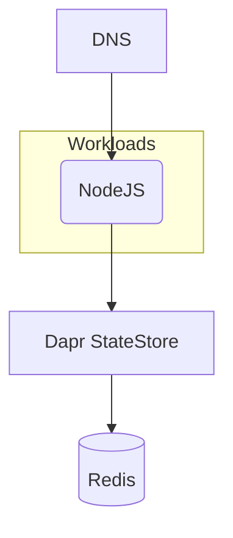

## Overview

In this example we will walk you through how you can deploy a containerized NodeJS application using a Dapr StateStore (Redis), and this with both `score-compose` and `score-k8s`.



## Score file

Open your IDE and paste in the following `score.yaml` file, which describes a simple web server exposed via a DNS that queries a Dapr StateStore (Redis) on each request. The demo code can be found [here](https://github.com/mathieu-benoit/dapr-score-humanitec).

```yaml
apiVersion: score.dev/v1b1
metadata:
  name: nodeapp
  annotations:
    dapr.io/enabled: "true"
    dapr.io/app-id: "nodeapp"
    dapr.io/app-port: "3000"
containers:
  nodeapp:
    image: .
    variables:
      APP_PORT: "3000"
      STATE_STORE_NAME: "${resources.state-store.name}"
service:
  ports:
    tcp:
      port: 3000
      targetPort: 3000
resources:
  state-store:
    type: dapr-state-store
  dns:
    type: dns
  route:
    type: route
    params:
      host: ${resources.dns.host}
      path: /
      port: 3000
```

## Deployment with `score-compose` and `score-k8s`

From here, we will now see how to deploy this exact same Score file with either with `score-compose` or with `score-k8s`:






## Next steps

- [**Explore more examples**](/docs/examples/): Check out more examples to dive into further use cases and experiment with different configurations.
- [**Watch the Dapr + Score session at KubeCon EU 2025**](https://sched.co/1txGi): Mixing the Perfect Cocktail for an Enhanced Developer Experience ([video](https://youtu.be/-fGztPUuD8k?list=PLj6h78yzYM2MP0QhYFK8HOb8UqgbIkLMc) and [repository](https://github.com/kendallroden/kubecon-dapr-score-demo)), showing more advanced use cases with Dapr PubSub and Dapr Workflow.
- [**Join the Score community**](): Connect with fellow Score developers on our CNCF Slack channel or start find your way to contribute to Score.
