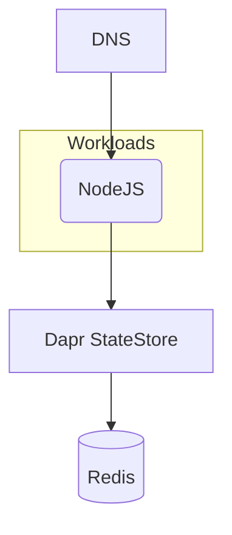

## Overview

In this example we will walk you through how you can deploy a NodeJS containerized application using a Dapr StateStore (Redis), and this with both `score-compose` and `score-k8s`.



## 1. `score.yaml`

Open your IDE and paste in the following `score.yaml` file, which describes a simple web server that queries a Dapr StateStore (Redis) on each request and is exposed via a DNS. The demo code can be found [here](https://github.com/mathieu-benoit/dapr-score-humanitec).

```yaml
apiVersion: score.dev/v1b1
metadata:
  name: nodeapp
  annotations:
    dapr.io/enabled: "true"
    dapr.io/app-id: "nodeapp"
    dapr.io/app-port: "3000"
containers:
  nodeapp:
    image: .
    variables:
      APP_PORT: "3000"
      STATE_STORE_NAME: "${resources.state-store.name}"
service:
  ports:
    tcp:
      port: 3000
      targetPort: 3000
resources:
  state-store:
    type: dapr-state-store
  dns:
    type: dns
  route:
    type: route
    params:
      host: ${resources.dns.host}
      path: /
      port: 3000
```

From here, you can deploy this exact same Score file:

- Either with [`score-compose`](#2-score-compose)
- Or with [`score-k8s`](#3-score-k8s)

## 2. `score-compose`

To begin, follow the [installation instructions](/docs/score-implementation/score-compose/installation) to install the latest version of `score-compose`.

### `init`

Initialize your current `score-compose` workspace, run the following command in your terminal:

```bash
score-compose init --no-sample \
    --provisioners https://raw.githubusercontent.com/score-spec/community-provisioners/refs/heads/main/dapr-state-store/score-compose/10-redis-dapr-state-store.provisioners.yaml \
    --patch-templates https://raw.githubusercontent.com/score-spec/community-patchers/refs/heads/main/score-compose/dapr.tpl
```

The `init` command will create the `.score-compose` directory with the [default resource provisioners]() available. We are also importing two external files to fully support and seamlessly support Dapr for this workload:

- [`dapr-state-store` provisioner](https://github.com/score-spec/community-provisioners/blob/main/dapr-state-store/score-compose/10-redis-dapr-state-store.provisioners.yaml): to generate a Dapr StateStore `Component` pointing to a Redis database.
- [Dapr patch template](https://github.com/score-spec/community-patchers/blob/main/score-compose/dapr.tpl): to generate the Dapr `scheduler` and `placement` in addition to a Dapr `Sidecar` for any Workload.

You can see the resource provisioners available by running this command:

```bash
score-compose provisioners list
```

The Score file example illustrated uses three resource types: `dapr-state-store`, `dns` and `route`.

```none
+-------------------+-------+------------------+--------------------------------+---------------------------------+
|     TYPE          | CLASS |      PARAMS      |            OUTPUTS             |          DESCRIPTION            |
+-------------------+-------+------------------+--------------------------------+---------------------------------+
| dapr-state-store  | (any) |                  | name                           | Generates a Dapr StateStore     |
|                   |       |                  |                                | Component pointing to a Redis   |
|                   |       |                  |                                | Service.                        |
+-------------------+-------+------------------+--------------------------------+---------------------------------+
| dns               | (any) |                  | host                           | Outputs a *.localhost domain    |
|                   |       |                  |                                | as the hostname                 |
+-------------------+-------+------------------+--------------------------------+---------------------------------+
| route             | (any) | host, path, port |                                | Provisions an Ingress route on  |
|                   |       |                  |                                | a shared Nginx instance         |
+-------------------+-------+------------------+--------------------------------+---------------------------------+
```

### `generate`

Convert the `score.yaml` file into a runnable `compose.yaml`, run the following command in your terminal:

```bash
score-compose generate score.yaml --image ghcr.io/dapr/samples/hello-k8s-node:latest
```

The `generate` command will add the input `score.yaml` workload with a particular container image to the `.score-compose/state.yaml` state file and generate the output `compose.yaml`.

If you want to build the container image when this `compose.yaml` will be deployed, you can run this `generate` command with the `--build` parameter instead:

```bash
score-compose generate score.yaml --build 'main={"context":".","tags":["hello-dapr-node:local"]}'
```

See the generated `compose.yaml` by running this command:

```bash
cat compose.yaml
```

If you make any modifications to the `score.yaml` file, run `score-compose generate score.yaml` to regenerate the output `compose.yaml`.

### `resources`

Get the information of the resources dependencies of the workload, run the following command:

```bash
score-compose resources list
```

```none
+----------------------------------------------+---------+
|                     UID                      | OUTPUTS |
+----------------------------------------------+---------+
| dapr-state-store.default#nodeapp.state-store | name    |
+----------------------------------------------+---------+
| dns.default#nodeapp.dns                      | host    |
+----------------------------------------------+---------+
| route.default#nodeapp.route                  |         |
+----------------------------------------------+---------+
```

At this stage, we can already see the value of the `dns` resource generated:

```bash
score-compose resources get-outputs dns.default#nodeapp.dns --format '{{ .host }}'
```

```none
dnsbcsqnd.localhost
```

Same for the `dapr-state-store` resource:

```bash
score-compose resources get-outputs dapr-state-store.default#nodeapp.state-store
```

```none
{
  "name": "redis-PANgkO"
}
```

### `docker compose`

Run `docker compose up` to execute the generated `compose.yaml` file:

```bash
docker compose up -d
```

```none
[+] Running 7/7
 ✔ Container dapr-redis-PANgkO-1             Started
 ✔ Container dapr-placement-1                Started
 ✔ Container dapr-scheduler-1                Started
 ✔ Container dapr-routing-aPCJB9-1           Started
 ✔ Container dapr-wait-for-resources-1       Exited
 ✔ Container dapr-nodeapp-nodeapp-1          Started
 ✔ Container dapr-nodeapp-nodeapp-sidecar-1  Started
```

### `docker ps`

See the running containers:

```bash
docker ps
```

```none
CONTAINER ID   IMAGE                                        COMMAND                  CREATED              STATUS              PORTS                                              NAMES
3c7dfd658b1a   mirror.gcr.io/redis:7-alpine                 "redis-server /usr/l…"   About a minute ago   Up About a minute   6379/tcp                                           dapr-redis-PANgkO-1
85c836ae19d2   ghcr.io/dapr/daprd:latest                    "./daprd --app-id=no…"   8 hours ago          Up 59 seconds                                                          dapr-nodeapp-nodeapp-sidecar-1
1f7affe5d910   ghcr.io/dapr/samples/hello-k8s-node:latest   "docker-entrypoint.s…"   8 hours ago          Up About a minute   3000/tcp                                           dapr-nodeapp-nodeapp-1
e7e1ae181a28   mirror.gcr.io/nginx:1-alpine                 "/docker-entrypoint.…"   8 hours ago          Up About a minute   0.0.0.0:8080->80/tcp, [::]:8080->80/tcp            dapr-routing-aPCJB9-1
f2983452962a   ghcr.io/dapr/scheduler:latest                "./scheduler --port …"   8 hours ago          Up About a minute   0.0.0.0:50007->50007/tcp, :::50007->50007/tcp      dapr-scheduler-1
913af9a5c8fc   ghcr.io/dapr/placement:latest                "./placement --port …"   8 hours ago          Up About a minute   0.0.0.0:50006->50006/tcp, :::50006->50006/tcp      dapr-placement-1
```

### `curl localhost:8080`

Test the running container, run the following command:

```bash
curl localhost:8080 -H "Host: dnsbcsqnd.localhost"
```

This will get the expected error showing that the container is successfully running:

```none
Cannot GET /
```

You can check the logs of the running container:

```none
Node App listening on port 3000!
```

Congrats! You’ve successfully deploy, with the `score-compose` implementation, a sample NodeJS containerized workload talking to a Dapr StateStore (Redis) and exposed via a DNS. You provisioned them through Docker, without writing the Docker Compose file by yourself.

## 3. `score-k8s`

To begin, follow the [installation instructions](/docs/score-implementation/score-k8s/installation) to install the latest version of `score-k8s`.

### `init`

Initialize your current `score-k8s` workspace, run the following command in your terminal:

```bash
score-k8s init --no-sample \
    --provisioners https://raw.githubusercontent.com/score-spec/community-provisioners/refs/heads/main/dapr-state-store/score-k8s/10-redis-dapr-state-store.provisioners.yaml
```

The `init` command will create the `.score-k8s` directory with the [default resource provisioners]() available. We are also importing one external file to fully support and seamlessly support Dapr for this workload:
- [`dapr-state-store` provisioner](https://github.com/score-spec/community-provisioners/blob/main/dapr-state-store/score-compose/10-redis-dapr-state-store.provisioners.yaml): to generate a Dapr StateStore `Component` pointing to a Redis database.

You can see the resource provisioners available by running this command:

```bash
score-k8s provisioners list
```

The Score file example illustrated uses three resource types: `dapr-state-store`, `dns` and `route`.

```none
+------------------+-------+------------------+--------------------------------+---------------------------------+
|     TYPE         | CLASS |      PARAMS      |            OUTPUTS             |          DESCRIPTION            |
+------------------+-------+------------------+--------------------------------+---------------------------------+
| dapr-state-store | (any) |                  | name                           | Generates a Dapr StateStore     |
|                  |       |                  |                                | Component pointing to a Redis   |
|                  |       |                  |                                | StatefulSet.                    |
+------------------+-------+------------------+--------------------------------+---------------------------------+
| dns              | (any) |                  | host                           | Outputs a *.localhost domain    |
|                  |       |                  |                                | as the hostname                 |
+------------------+-------+------------------+--------------------------------+---------------------------------+
| route            | (any) | host, path, port |                                | Provisions an Ingress route on  |
|                  |       |                  |                                | a shared Nginx instance         |
+------------------+-------+------------------+--------------------------------+---------------------------------+
```

### `generate`

Convert the `score.yaml` file into a runnable `manifests.yaml`, run the following command in your terminal:

```bash
score-k8s generate score.yaml --image ghcr.io/dapr/samples/hello-k8s-node:latest
```

The `generate` command will add the input `score.yaml` workload with a particular container image to the `.score-k8s/state.yaml` state file and generate the output `manifests.yaml`.

See the generated `manifests.yaml` by running this command:

```bash
cat manifests.yaml
```

If you make any modifications to the `score.yaml` file, run `score-k8s generate score.yaml` to regenerate the output `manifests.yaml`.

### `resources`

Get the information of the resources dependencies of the workload, run the following command:

```bash
score-k8s resources list
```

```none
+----------------------------------------------+---------+
|                     UID                      | OUTPUTS |
+----------------------------------------------+---------+
| dapr-state-store.default#nodeapp.state-store | name    |
+----------------------------------------------+---------+
| dns.default#nodeapp.dns                      | host    |
+----------------------------------------------+---------+
| route.default#nodeapp.route                  |         |
+----------------------------------------------+---------+
```

At this stage, we can already see the value of the `dns` resource generated:

```bash
score-k8s resources get-outputs dns.default#nodeapp.dns --format '{{ .host }}'
```

```none
dnsutripw.localhost
```

Same for the `dapr-state-store` resource:

```bash
score-k8s resources get-outputs dapr-state-store.default#nodeapp.state-store
```

```none
{
  "name": "redis-nodeapp-58f89990"
}
```

### `kubectl apply`

_Here you will need to have access to a Kubernetes cluster to execute the following commands. You can follow [these instructions](/docs/how-to/score-k8s/kind-cluster/) if you want to set up a Kind cluster. Your Kubernetes cluster should also have [Dapr installed](https://docs.dapr.io/operations/hosting/kubernetes/kubernetes-overview/) in it._

Run `kubectl apply` to execute the generated `manifests.yaml` file:

```bash
kubectl apply -f manifests.yaml
```

```none
secret/redis-nodeapp-58f89990 created
statefulset.apps/redis-nodeapp-58f89990 created
service/redis-nodeapp-58f89990 created
component.dapr.io/redis-nodeapp-58f89990 created
httproute.gateway.networking.k8s.io/route-nodeapp-3f3a9362 created
service/nodeapp created
deployment.apps/nodeapp created
```

### `kubectl get all`

See the running containers:

```bash
kubectl get all
```

```none
NAME                           READY   STATUS    RESTARTS   AGE
pod/nodeapp-859d5458f6-75wjj   1/1     Running   0          3m43s
pod/redis-nodeapp-58f89990-0   1/1     Running   0          3m43s

NAME                             TYPE        CLUSTER-IP      EXTERNAL-IP   PORT(S)                               AGE
service/nodeapp                  ClusterIP   10.96.138.145   <none>        3000/TCP                              3m43s
service/nodeapp-dapr             ClusterIP   None            <none>        80/TCP,50001/TCP,50002/TCP,9090/TCP   51s
service/redis-nodeapp-58f89990   ClusterIP   10.96.71.72     <none>        6379/TCP                              3m43s

NAME                      READY   UP-TO-DATE   AVAILABLE   AGE
deployment.apps/nodeapp   1/1     1            1           3m43s

NAME                                 DESIRED   CURRENT   READY   AGE
replicaset.apps/nodeapp-859d5458f6   1         1         1       3m43s

NAME                                      READY   AGE
statefulset.apps/redis-nodeapp-58f89990   1/1     3m43s
```

### `curl localhost`

Test the running container, run the following command:

```bash
curl localhost -H "Host: dnsutripw.localhost"
```

This will get the expected error showing that the container is successfully running:

```none
Cannot GET /
```

You can check the logs of the running container:

```none
Node App listening on port 3000!
```

Congrats! You’ve successfully deploy, with the `score-k8s` implementation, a sample NodeJS containerized workload talking to a Dapr StateStore (Redis) and exposed via a DNS. You provisioned them through `kubectl`, without writing the Kubernetes manifests file by yourself.

## Next steps

- [**Explore more examples**](/docs/examples/): Check out more examples to dive into further use cases and experiment with different configurations.
- [**Watch the Dapr + Score session at KubeCon EU 2025**](https://sched.co/1txGi): Mixing the Perfect Cocktail for an Enhanced Developer Experience ([video](https://youtu.be/-fGztPUuD8k?list=PLj6h78yzYM2MP0QhYFK8HOb8UqgbIkLMc) and [repository](https://github.com/kendallroden/kubecon-dapr-score-demo)), showing more advanced use cases with Dapr PubSub and Dapr Workflow.
- [**Join the Score community**](): Connect with fellow Score developers on our CNCF Slack channel or start find your way to contribute to Score.
