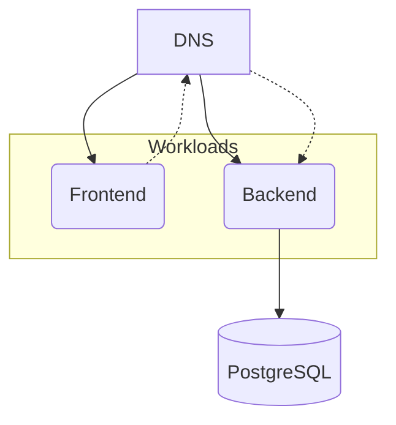

## Overview

In this example we will walk you through how you can deploy a containerized Frontend application talking to a Backend application, and this with both `score-compose` and `score-k8s`.



## Score files

Open your IDE and paste in the following `score-frontend.yaml` file, which describes the containerized Nginx Frontend application exposed via a DNS that contact a Backend application on each request. The demo code can be found [here](https://github.com/mathieu-benoit/deploy-backstage-with-score).

```yaml
apiVersion: score.dev/v1b1
metadata:
  name: frontend
  annotations:
    tags: "nginx,javascript,html,css,website"
containers:
  frontend:
    image: .
    variables:
      APP_CONFIG_app_baseUrl: ${resources.dns.url}
      APP_CONFIG_backend_baseUrl: ${resources.dns.url}
    livenessProbe:
      httpGet:
        path: /healthcheck
        port: 8080
    readinessProbe:
      httpGet:
        path: /healthcheck
        port: 8080
service:
  ports:
    tcp:
      port: 3000
      targetPort: 8080
resources:
  backend:
    type: service
  dns:
    type: dns
    id: dns
  route:
    type: route
    params:
      host: ${resources.dns.host}
      path: /
      port: 3000
```

The following `score-backend.yaml` file describes the containerized the NodeJS Backend application talking to a PostgreSQL database:

```yaml
apiVersion: score.dev/v1b1
metadata:
  name: backend
containers:
  backend:
    image: .
    command:
      - "node"
    args:
      - packages/backend
      - "--config"
      - app-config.yaml
      - "--config"
      - app-config.production.yaml
    variables:
      POSTGRES_HOST: ${resources.pg.host}
      POSTGRES_PASSWORD: ${resources.pg.password}
      POSTGRES_PORT: ${resources.pg.port}
      POSTGRES_USER: ${resources.pg.username}
      APP_CONFIG_auth_providers_guest_dangerouslyAllowOutsideDevelopment: "true"
      APP_CONFIG_backend_cors_origin: ${resources.dns.url}
      APP_CONFIG_techRadar_url: https://github.com/mathieu-benoit/humanitec-ref-arch/blob/main/tech-radar.json
    livenessProbe:
      httpGet:
        path: /.backstage/health/v1/liveness
        port: 7007
    readinessProbe:
      httpGet:
        path: /.backstage/health/v1/readiness
        port: 7007
service:
  ports:
    tcp:
      port: 7007
      targetPort: 7007
resources:
  pg:
    type: postgres-instance
  dns:
    type: dns
    id: dns
  route:
    type: route
    params:
      host: ${resources.dns.host}
      path: /api
      port: 7007
```

## Deployment with `score-compose` and `score-k8s`

From here, we will now see how to deploy these exact same Score files with either with `score-compose` or with `score-k8s`:






## Next steps

- [**Deep dive with the associated step-by-step guide**](https://medium.com/@mabenoit/deploy-backstage-with-score-45bb2d7c2d90): Go through the associated step-by-step guide to understand the different concepts with both: Backstage and Score.
- [**Explore more examples**](/docs/examples/): Check out more examples to dive into further use cases and experiment with different configurations.
- [**Join the Score community**](): Connect with fellow Score developers on our CNCF Slack channel or start find your way to contribute to Score.
