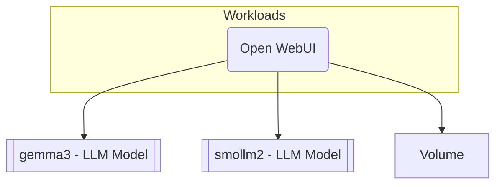

## Overview

In this example we will walk you through how you can deploy local LLM models with [Open WebUI](https://github.com/open-webui/open-webui) as the frontend, and this with `score-compose`. We'll cover two approaches to running the LLM models locally: using [Ollama](https://ollama.com/) and using [Docker Model Runner (DMR)](https://docs.docker.com/desktop/features/model-runner/).



## Score file

Open your IDE and paste in the following `score.yaml` file, which describes an Open WebUI application that connects to two LLM models (`gemma3` and `smollm2`) and stores its data in a persistent volume.

For the **Ollama** scenario:

```yaml
apiVersion: score.dev/v1b1
metadata:
  name: open-webui
containers:
  open-webui:
    image: .
    variables:
      OLLAMA_BASE_URL: "${resources.gemma3.url}"
    volumes:
      /app/backend/data:
        source: ${resources.data}
resources:
  data:
    type: volume
  gemma3:
    type: llm-model
    params:
      model: gemma3:270m
  smollm2:
    type: llm-model
    params:
      model: smollm2:135m
service:
  ports:
    tcp:
      port: 8080
      targetPort: 8080
```

For the **Docker Model Runner (DMR)** scenario, the `score.yaml` file is almost identical. The key differences are the model names, which follow the DMR naming convention:

```yaml
apiVersion: score.dev/v1b1
metadata:
  name: open-webui
containers:
  open-webui:
    image: .
    variables:
      OLLAMA_BASE_URL: "${resources.smollm2.url}"
    volumes:
      /app/backend/data:
        source: ${resources.data}
resources:
  data:
    type: volume
  gemma3:
    type: llm-model
    params:
      model: ai/gemma3:270M-UD-IQ2_XXS
  smollm2:
    type: llm-model
    params:
      model: ai/smollm2:135M-Q2_K
service:
  ports:
    tcp:
      port: 8080
      targetPort: 8080
```

Both files use the `llm-model` resource type to request LLM models. The `score-compose` provisioners handle the underlying infrastructure differences (Ollama container vs Docker Model Runner) transparently.

## Deployment with `score-compose`

From here, we will now see how to deploy this Score file with `score-compose`, using either Ollama or Docker Model Runner as the LLM backend:






## Next steps

- [**Deep dive with the associated blog post**](https://medium.com/google-cloud/score-docker-compose-to-deploy-your-local-llm-models-10aff89686ce): Go through the associated step-by-step blog post to understand the different concepts in more detail.
- [**Explore more examples**](/examples/): Check out more examples to dive into further use cases and experiment with different configurations.
- [**Join the Score community**](): Connect with fellow Score developers on our CNCF Slack channel or start find your way to contribute to Score.
