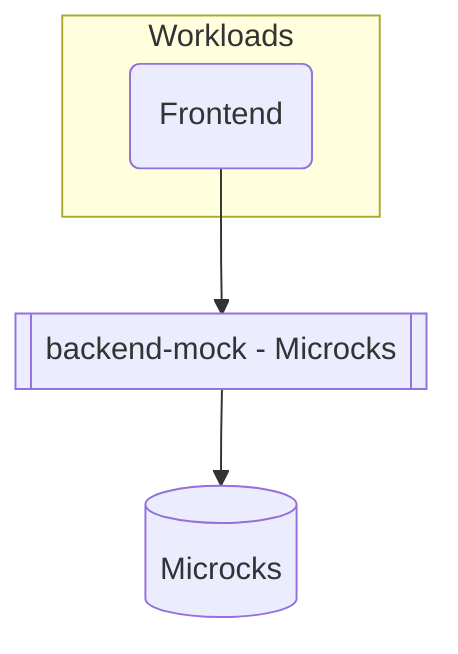

## Overview

In this example we will walk you through how you can deploy a containerized frontend application using [Microcks](https://microcks.io/) to mock an external backend service dependency, and this with both `score-compose` and `score-k8s`.



## Score file

Open your IDE and paste in the following `score.yaml` file, which describes a simple frontend application that references a backend service resource via its [OpenAPI specification](https://github.com/mathieu-benoit/score-microcks/blob/main/resources/backend-openapi.yaml). The demo code can be found [here](https://github.com/mathieu-benoit/score-microcks).

```yaml
apiVersion: score.dev/v1b1
metadata:
  name: frontend
containers:
  frontend:
    image: busybox
    command: ["/bin/sh"]
    args: ["-c", "while true; do echo Hello $BACKEND_SVC!; sleep 5; done"]
    variables:
      BACKEND_SVC: ${resources.backend.url}/orders
resources:
  backend:
    type: service
    params:
      port: 8181
      artifacts: resources/backend-openapi.yaml:true
      name: Order Service API
      version: 0.1.0
```

In the `resources` section, the `backend` resource of type `service` declares the external backend dependency. The Developer only needs to know _that_ a backend service exists and _what_ its OpenAPI spec looks like — Microcks handles generating a realistic mock at deployment time, resolving `${resources.backend.url}` automatically.

## Deployment with `score-compose` and `score-k8s`

From here, we will now see how to deploy this exact same Score file with either with `score-compose` or with `score-k8s`:






## Next steps

- [**Deep dive with the associated blog post**](https://itnext.io/unifying-inner-outer-loops-to-bridge-the-gaps-between-devs-ops-with-containers-microcks-d28603342f4b): Go through the step-by-step guide to understand the concepts of bridging inner and outer development loops with Containers, Microcks, and Score.
- [**Watch the Score + Microcks session at KubeCon EU 2026**](https://sched.co/2CVxb): _Unifying Inner & Outer Loops To Bridge the Gaps Between Devs & Ops With Microcks + Score_ — Laurent Broudoux (Microcks) & Mathieu Benoit (Docker), showing a more advanced use case.
- [**Explore more examples**](/examples/): Check out more examples to dive into further use cases and experiment with different configurations.
- [**Join the Score community**](): Connect with fellow Score developers on our CNCF Slack channel or start find your way to contribute to Score.
