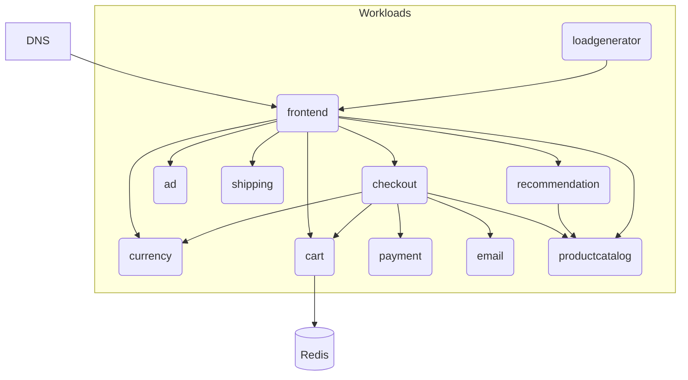

## Overview

In this example we will walk you through how you can deploy eleven containerized applications illustrating the [OnlineBoutique demo](https://github.com/GoogleCloudPlatform/microservices-demo), and this with both `score-compose` and `score-k8s`.



## 1. `score-*.yaml`

We will describe each containerized application with its own Score file for each. The demo code can be found [here](https://github.com/Humanitec-DemoOrg/onlineboutique-demo/tree/main).

Open your IDE and paste in the following `score-frontend.yaml` file, which describes the `frontend` containerized application exposed via a DNS that queries different other applications on each request:

```yaml
apiVersion: score.dev/v1b1
metadata:
  name: frontend
containers:
  frontend:
    image: .
    livenessProbe:
      httpGet:
        path: /_healthz
        port: 8080
        httpHeaders:
        - name: Cookie
          value: shop_session-id=x-liveness-probe
    readinessProbe:
      httpGet:
        path: /_healthz
        port: 8080
        httpHeaders:
        - name: Cookie
          value: shop_session-id=x-readiness-probe
    variables:
      AD_SERVICE_ADDR: "${resources.ad.name}:9555"
      CART_SERVICE_ADDR: "${resources.cart.name}:7070"
      CHECKOUT_SERVICE_ADDR: "${resources.checkout.name}:5050"
      CURRENCY_SERVICE_ADDR: "${resources.currency.name}:7000"
      ENABLE_PROFILER: "0"
      PAYMENT_SERVICE_ADDR: "${resources.payment.name}:50051"
      PORT: "8080"
      PRODUCT_CATALOG_SERVICE_ADDR: "${resources.productcatalog.name}:3550"
      RECOMMENDATION_SERVICE_ADDR: "${resources.recommendation.name}:8080"
      SHIPPING_SERVICE_ADDR: "${resources.shipping.name}:50051"
      SHOPPING_ASSISTANT_SERVICE_ADDR: "not-used-here:8080"
      CYMBAL_BRANDING: "false"
      FRONTEND_MESSAGE: ""
      ENABLE_ASSISTANT: "false"
    resources:
      limits:
        memory: "50Mi"
        cpu: "50m"
      requests:
        memory: "30Mi"
        cpu: "30m"
service:
  ports:
    http:
      port: 8080
      targetPort: 8080
resources:
  dns:
    type: dns
  route:
    type: route
    params:
      host: ${resources.dns.host}
      path: /
      port: 8080
  ad:
    type: service
  cart:
    type: service
  checkout:
    type: service
  currency:
    type: service
  payment:
    type: service
  productcatalog:
    type: service
  recommendation:
    type: service
  shipping:
    type: service
```

the following `score-cart.yaml` file, which describes the `cart` containerized application exposed via a DNS that queries different other applications on each request:

```yaml
apiVersion: score.dev/v1b1
metadata:
  name: cart
containers:
  cart:
    image: .
    variables:
      REDIS_ADDR: "${resources.redis-cart.host}:${resources.redis-cart.port},user=${resources.redis-cart.username},password=${resources.redis-cart.password}"
    resources:
      limits:
        memory: "90Mi"
        cpu: "220m"
      requests:
        memory: "70Mi"
        cpu: "200m"
service:
  ports:
    grpc:
      port: 7070
      targetPort: 7070
resources:
  redis-cart:
    type: redis
```

Just two Score files have been illustrated above, you can grab the other Score files from [this GitHub repository](https://github.com/Humanitec-DemoOrg/onlineboutique-demo/tree/main/apps).

From here, you can deploy these Score files:

- Either with [`score-compose`](#2-score-compose)
- Or with [`score-k8s`](#3-score-k8s)

## 2. `score-compose`

To begin, follow the [installation instructions](/docs/score-implementation/score-compose/installation) to install the latest version of `score-compose`.

### `init`

Initialize your current `score-compose` workspace, run the following command in your terminal:

```bash
score-compose init --no-sample \
    --provisioners https://raw.githubusercontent.com/score-spec/community-provisioners/refs/heads/main/service/score-compose/10-service.provisioners.yaml
```

The `init` command will create the `.score-compose` directory with the [default resource provisioners]() available. We are also importing one external file to support the `service` dependencies: [`service` provisioner](https://github.com/score-spec/community-provisioners/blob/main/service/score-compose/10-service.provisioners.yaml).

You can see the resource provisioners available by running this command:

```bash
score-compose provisioners list
```

The Score files illustrated use four resource types: `dns`, `redis`, `route` and `service`.

```none
+-------------------+-------+------------------+--------------------------------+--------------------------------+
|     TYPE          | CLASS |      PARAMS      |            OUTPUTS             |          DESCRIPTION           |
+-------------------+-------+------------------+--------------------------------+--------------------------------+
| dns               | (any) |                  | host                           | Outputs a *.localhost domain   |
|                   |       |                  |                                | as the hostname                |
+-------------------+-------+------------------+--------------------------------+--------------------------------+
| redis             | (any) |                  | host, password, port, username | Provisions a dedicated Redis   |
|                   |       |                  |                                | instance.                      |
+-------------------+-------+------------------+--------------------------------+--------------------------------+
| route             | (any) | host, path, port |                                | Provisions an Ingress route on |
|                   |       |                  |                                | a shared Nginx instance        |
+-------------------+-------+------------------+--------------------------------+--------------------------------+
| service           | (any) |                  | name                           | Outputs the name of the        |
|                   |       |                  |                                | Workload dependency if         |
|                   |       |                  |                                | it exists in the list of       |
|                   |       |                  |                                | Workloads.                     |
+-------------------+-------+------------------+--------------------------------+--------------------------------+
```

### `generate`

Convert the `score-*.yaml` files into a runnable `compose.yaml`, run the following commands in your terminal:

```bash
score-compose generate score-cart.yaml \
    --image us-central1-docker.pkg.dev/google-samples/microservices-demo/cartservice:v0.10.2
score-compose generate score-currency.yaml \
    --image us-central1-docker.pkg.dev/google-samples/microservices-demo/currencyservice:v0.10.2
score-compose generate score-payment.yaml \
    --image us-central1-docker.pkg.dev/google-samples/microservices-demo/paymentservice:v0.10.2
score-compose generate score-email.yaml \
    --image us-central1-docker.pkg.dev/google-samples/microservices-demo/emailservice:v0.10.2
score-compose generate score-productcatalog.yaml \
    --image us-central1-docker.pkg.dev/google-samples/microservices-demo/productcatalogservice:v0.10.2
score-compose generate score-shipping.yaml \
    --image us-central1-docker.pkg.dev/google-samples/microservices-demo/shippingservice:v0.10.2
score-compose generate score-ad.yaml \
    --image us-central1-docker.pkg.dev/google-samples/microservices-demo/adservice:v0.10.2
score-compose generate score-recommendation.yaml \
    --image us-central1-docker.pkg.dev/google-samples/microservices-demo/recommendationservice:v0.10.2
score-compose generate score-checkout.yaml \
    --image us-central1-docker.pkg.dev/google-samples/microservices-demo/checkoutservice:v0.10.2
score-compose generate score-frontend.yaml \
    --image us-central1-docker.pkg.dev/google-samples/microservices-demo/frontend:v0.10.2
score-compose generate score-loadgenerator.yaml \
    --image us-central1-docker.pkg.dev/google-samples/microservices-demo/loadgenerator:v0.10.2
```

The `generate` commands will add the input `score-*.yaml` workloads with a particular container image to the `.score-compose/state.yaml` state file and generate the output `compose.yaml`.

If you want to build the container image when this `compose.yaml` will be deployed, you can run these `generate` commands with the `--build` parameter instead:

```bash
score-compose generate score-frontend.yaml --build 'main={"context":".","tags":["frontend:local"]}'
```

See the generated `compose.yaml` by running this command:

```bash
cat compose.yaml
```

If you make any modifications to the `score-*.yaml` files, run `score-compose generate score-*.yaml` to regenerate the output `compose.yaml`.

### `resources`

Get the information of the resources dependencies of the workloads, run the following command:

```bash
score-compose resources list
```

```none
+-----------------------------------------------+--------------------------------+
|                      UID                      |            OUTPUTS             |
+-----------------------------------------------+--------------------------------+
| dns.default#frontend.dns                      | host                           |
+-----------------------------------------------+--------------------------------+
| redis.default#cart.redis-cart                 | host, password, port, username |
+-----------------------------------------------+--------------------------------+
| service.default#checkout.cart                 | name                           |
+-----------------------------------------------+--------------------------------+
| service.default#checkout.currency             | name                           |
+-----------------------------------------------+--------------------------------+
| service.default#checkout.email                | name                           |
+-----------------------------------------------+--------------------------------+
| service.default#checkout.payment              | name                           |
+-----------------------------------------------+--------------------------------+
| service.default#checkout.productcatalog       | name                           |
+-----------------------------------------------+--------------------------------+
| service.default#checkout.shipping             | name                           |
+-----------------------------------------------+--------------------------------+
| service.default#frontend.ad                   | name                           |
+-----------------------------------------------+--------------------------------+
| service.default#frontend.cart                 | name                           |
+-----------------------------------------------+--------------------------------+
| service.default#frontend.checkout             | name                           |
+-----------------------------------------------+--------------------------------+
| service.default#frontend.currency             | name                           |
+-----------------------------------------------+--------------------------------+
| service.default#frontend.payment              | name                           |
+-----------------------------------------------+--------------------------------+
| service.default#frontend.productcatalog       | name                           |
+-----------------------------------------------+--------------------------------+
| service.default#frontend.recommendation       | name                           |
+-----------------------------------------------+--------------------------------+
| service.default#frontend.shipping             | name                           |
+-----------------------------------------------+--------------------------------+
| service.default#loadgenerator.frontend        | name                           |
+-----------------------------------------------+--------------------------------+
| service.default#recommendation.productcatalog | name                           |
+-----------------------------------------------+--------------------------------+
| route.default#frontend.route                  |                                |
+-----------------------------------------------+--------------------------------+
```

At this stage, we can already see the value of the `dns` resource generated of the `frontend` workload:

```bash
score-compose resources get-outputs dns.default#frontend.dns --format '{{ .host }}'
```

```none
dnsyh32qu.localhost
```

Same for the `redis` resource of the `cart` workload:

```bash
score-compose resources get-outputs redis.default#cart.redis-cart
```

```none
{
  "host": "redis-NYOMHD",
  "password": "REDACTED",
  "port": 6379,
  "username": "REDACTED"
}
```

### `docker compose`

Run `docker compose up` to execute the generated `compose.yaml` file:

```bash
docker compose up -d
```

```none
[+] Running 16/16
 ✔ Network ob_default                            Created
 ✔ Volume "redis-NYOMHD-data"                    Created
 ✔ Container ob-redis-NYOMHD-1                   Started
 ✔ Container ob-routing-K7ZrCr-1                 Started
 ✔ Container ob-wait-for-resources-1             Exited
 ✔ Container ob-checkout-checkout-1              Started
 ✔ Container ob-email-email-1                    Started
 ✔ Container ob-currency-currency-1              Started
 ✔ Container ob-frontend-frontend-1              Started
 ✔ Container ob-recommendation-recommendation-1  Started
 ✔ Container ob-productcatalog-productcatalog-1  Started
 ✔ Container ob-shipping-shipping-1              Started
 ✔ Container ob-cart-cart-1                      Started
 ✔ Container ob-ad-ad-1                          Started
 ✔ Container ob-payment-payment-1                Started
 ✔ Container ob-loadgenerator-loadgenerator-1    Started
```

### `docker ps`

See the running containers:

```bash
docker ps
```

```none
CONTAINER ID   IMAGE                                                                                        COMMAND                  CREATED              STATUS              PORTS                                              NAMES
2420e4a5b044   us-central1-docker.pkg.dev/google-samples/microservices-demo/frontend:v0.10.2                "/src/server"            9 minutes ago        9 minutes ago       8080/tcp                                           ob-frontend-frontend-1
0c8705f6571a   us-central1-docker.pkg.dev/google-samples/microservices-demo/adservice:v0.10.2               "/app/build/install/…"   9 minutes ago        Up 9 minutes        9555/tcp                                           ob-ad-ad-1
0d72556cc169   us-central1-docker.pkg.dev/google-samples/microservices-demo/loadgenerator:v0.10.2           "/bin/sh -c 'locust …"   9 minutes ago        Up 9 minutes                                                           ob-loadgenerator-loadgenerator-1
8c72e85b4c66   us-central1-docker.pkg.dev/google-samples/microservices-demo/checkoutservice:v0.10.2         "/src/checkoutservice"   9 minutes ago        Up 9 minutes        5050/tcp                                           ob-checkout-checkout-1
2dd9df6fa024   us-central1-docker.pkg.dev/google-samples/microservices-demo/productcatalogservice:v0.10.2   "/src/server"            9 minutes ago        Up 9 minutes        3550/tcp                                           ob-productcatalog-productcatalog-1
a6d0ebc3aab2   us-central1-docker.pkg.dev/google-samples/microservices-demo/paymentservice:v0.10.2          "node index.js"          9 minutes ago        Up 9 minutes        50051/tcp                                          ob-payment-payment-1
e2511187e454   us-central1-docker.pkg.dev/google-samples/microservices-demo/recommendationservice:v0.10.2   "python recommendati…"   9 minutes ago        Up 9 minutes        8080/tcp                                           ob-recommendation-recommendation-1
a4156abacd40   us-central1-docker.pkg.dev/google-samples/microservices-demo/cartservice:v0.10.2             "/app/cartservice"       9 minutes ago        Up 9 minutes        7070/tcp                                           ob-cart-cart-1
2379e57ac8ca   us-central1-docker.pkg.dev/google-samples/microservices-demo/currencyservice:v0.10.2         "node server.js"         9 minutes ago        Up 9 minutes        7000/tcp                                           ob-currency-currency-1
81efe5bcde69   us-central1-docker.pkg.dev/google-samples/microservices-demo/emailservice:v0.10.2            "python email_server…"   9 minutes ago        Up 9 minutes        8080/tcp                                           ob-email-email-1
d83a61963aa6   us-central1-docker.pkg.dev/google-samples/microservices-demo/shippingservice:v0.10.2         "/src/shippingservice"   9 minutes ago        Up 9 minutes        50051/tcp                                          ob-shipping-shipping-1
ed5f79d80259   mirror.gcr.io/redis:7-alpine                                                                 "redis-server /usr/l…"   9 minutes ago        Up 9 minutes        6379/tcp                                           ob-redis-NYOMHD-1
6ee7b587922f   mirror.gcr.io/nginx:1-alpine                                                                 "/docker-entrypoint.…"   9 minutes ago        Up 9 minutes        0.0.0.0:8080->80/tcp, [::]:8080->80/tcp            ob-routing-K7ZrCr-1
```

### `curl localhost:8080`

Test the running `frontend` container, run the following command:

```bash
curl localhost:8080 -H "Host: dnsyh32qu.localhost"
```

Congrats! You’ve successfully deploy, with the `score-compose` implementation, the eleven containerized workload exposed via a DNS and talking to a `redis` database. You provisioned them through Docker, without writing the Docker Compose file by yourself.

## 3. `score-k8s`

To begin, follow the [installation instructions](/docs/score-implementation/score-k8s/installation) to install the latest version of `score-k8s`.

### `init`

Initialize your current `score-k8s` workspace, run the following command in your terminal:

```bash
score-k8s init --no-sample \
    --provisioners https://raw.githubusercontent.com/score-spec/community-provisioners/refs/heads/main/service/score-compose/10-service.provisioners.yaml
```

The `init` command will create the `.score-k8s` directory with the [default resource provisioners]() available. We are also importing one external file to support the `service` dependencies: [`service` provisioner](https://github.com/score-spec/community-provisioners/blob/main/service/score-k8s/10-service.provisioners.yaml).

You can see the resource provisioners available by running this command:

```bash
score-k8s provisioners list
```

The Score files illustrated use three resource types: `dns`, `route`, `redis` and `service`.

```none
+------------------+-------+------------------+--------------------------------+---------------------------------+
|     TYPE         | CLASS |      PARAMS      |            OUTPUTS             |          DESCRIPTION            |
+------------------+-------+------------------+--------------------------------+---------------------------------+
| dns              | (any) |                  | host                           | Outputs a *.localhost domain    |
|                  |       |                  |                                | as the hostname                 |
+------------------+-------+------------------+--------------------------------+---------------------------------+
| route            | (any) | host, path, port |                                | Provisions an Ingress route on  |
|                  |       |                  |                                | a shared Nginx instance         |
+------------------+-------+------------------+--------------------------------+---------------------------------+
| redis            | (any) |                  | host, password, port, username | Provisions a dedicated redis    |
|                  |       |                  |                                | instance                        |
+------------------+-------+------------------+--------------------------------+---------------------------------+
| service          | (any) |                  | name                           | Outputs the name of the         |
|                  |       |                  |                                | Workload dependency if          |
|                  |       |                  |                                | it exists in the list of        |
|                  |       |                  |                                | Workloads.                      |
+------------------+-------+------------------+--------------------------------+---------------------------------+
```

### `generate`

Convert the `score-*.yaml` files into a runnable `manifests.yaml`, run the following command in your terminal:

```bash
score-k8s generate score-cart.yaml \
    --image us-central1-docker.pkg.dev/google-samples/microservices-demo/cartservice:v0.10.2
score-k8s generate score-currency.yaml \
    --image us-central1-docker.pkg.dev/google-samples/microservices-demo/currencyservice:v0.10.2
score-k8s generate score-payment.yaml \
    --image us-central1-docker.pkg.dev/google-samples/microservices-demo/paymentservice:v0.10.2
score-k8s generate score-email.yaml \
    --image us-central1-docker.pkg.dev/google-samples/microservices-demo/emailservice:v0.10.2
score-k8s generate score-productcatalog.yaml \
    --image us-central1-docker.pkg.dev/google-samples/microservices-demo/productcatalogservice:v0.10.2
score-k8s generate score-shipping.yaml \
    --image us-central1-docker.pkg.dev/google-samples/microservices-demo/shippingservice:v0.10.2
score-k8s generate score-ad.yaml \
    --image us-central1-docker.pkg.dev/google-samples/microservices-demo/adservice:v0.10.2
score-k8s generate score-recommendation.yaml \
    --image us-central1-docker.pkg.dev/google-samples/microservices-demo/recommendationservice:v0.10.2
score-k8s generate score-checkout.yaml \
    --image us-central1-docker.pkg.dev/google-samples/microservices-demo/checkoutservice:v0.10.2
score-k8s generate score-frontend.yaml \
    --image us-central1-docker.pkg.dev/google-samples/microservices-demo/frontend:v0.10.2
score-k8s generate score-loadgenerator.yaml \
    --image us-central1-docker.pkg.dev/google-samples/microservices-demo/loadgenerator:v0.10.2
```

The `generate` command will add the input `score-*.yaml` workloads with a particular container image to the `.score-k8s/state.yaml` state file and generate the output `manifests.yaml`.

See the generated `manifests.yaml` by running this command:

```bash
cat manifests.yaml
```

If you make any modifications to the `score.yaml` file, run `score-k8s generate score.yaml` to regenerate the output `manifests.yaml`.

### `resources`

Get the information of the resources dependencies of the workload, run the following command:

```bash
score-k8s resources list
```

```none
+-----------------------------------------------+--------------------------------+
|                      UID                      |            OUTPUTS             |
+-----------------------------------------------+--------------------------------+
| dns.default#frontend.dns                      | host                           |
+-----------------------------------------------+--------------------------------+
| redis.default#cart.redis-cart                 | host, password, port, username |
+-----------------------------------------------+--------------------------------+
| service.default#checkout.cart                 | name                           |
+-----------------------------------------------+--------------------------------+
| service.default#checkout.currency             | name                           |
+-----------------------------------------------+--------------------------------+
| service.default#checkout.email                | name                           |
+-----------------------------------------------+--------------------------------+
| service.default#checkout.payment              | name                           |
+-----------------------------------------------+--------------------------------+
| service.default#checkout.productcatalog       | name                           |
+-----------------------------------------------+--------------------------------+
| service.default#checkout.shipping             | name                           |
+-----------------------------------------------+--------------------------------+
| service.default#frontend.ad                   | name                           |
+-----------------------------------------------+--------------------------------+
| service.default#frontend.cart                 | name                           |
+-----------------------------------------------+--------------------------------+
| service.default#frontend.checkout             | name                           |
+-----------------------------------------------+--------------------------------+
| service.default#frontend.currency             | name                           |
+-----------------------------------------------+--------------------------------+
| service.default#frontend.payment              | name                           |
+-----------------------------------------------+--------------------------------+
| service.default#frontend.productcatalog       | name                           |
+-----------------------------------------------+--------------------------------+
| service.default#frontend.recommendation       | name                           |
+-----------------------------------------------+--------------------------------+
| service.default#frontend.shipping             | name                           |
+-----------------------------------------------+--------------------------------+
| service.default#loadgenerator.frontend        | name                           |
+-----------------------------------------------+--------------------------------+
| service.default#recommendation.productcatalog | name                           |
+-----------------------------------------------+--------------------------------+
| route.default#frontend.route                  |                                |
+-----------------------------------------------+--------------------------------+
```

At this stage, we can already see the value of the `dns` resource generated for the `frontend` workload:

```bash
score-k8s resources get-outputs dns.default#frontend.dns --format '{{ .host }}'
```

```none
dnsjbzrxg.localhost
```

Same for the `redis` resource of the `cart` workload:

```bash
score-k8s resources get-outputs redis.default#cart.redis-cart
```

```none
{
  "host": "redis-cart-deeb231e",
  "password": "🔐💬redis-cart-deeb231e_password💬🔐",
  "port": 6379,
  "username": "REDACTED"
}
```

### `kubectl apply`

_Here you will need to have access to a Kubernetes cluster to execute the following commands. You can follow [these instructions](/docs/how-to/score-k8s/kind-cluster/) if you want to set up a Kind cluster._

Run `kubectl apply` to execute the generated `manifests.yaml` file:

```bash
kubectl apply -f manifests.yaml
```

```none
secret/redis-cart-deeb231e created
statefulset.apps/redis-cart-deeb231e created
service/redis-cart-deeb231e created
httproute.gateway.networking.k8s.io/route-frontend-baaed48f created
service/payment created
deployment.apps/payment created
deployment.apps/loadgenerator created
service/cart created
deployment.apps/cart created
service/currency created
deployment.apps/currency created
service/productcatalog created
deployment.apps/productcatalog created
service/shipping created
deployment.apps/shipping created
service/email created
deployment.apps/email created
service/frontend created
deployment.apps/frontend created
service/recommendation created
deployment.apps/recommendation created
service/ad created
deployment.apps/ad created
service/checkout created
deployment.apps/checkout created
```

### `kubectl get all`

See the running containers:

```bash
kubectl get all
```

```none
NAME                                  READY   STATUS    RESTARTS   AGE
pod/ad-dc7944975-bj8w4                1/1     Running   0          119s
pod/cart-798bd7698-264pg              1/1     Running   0          2m1s
pod/checkout-744f8dcfb-7g56m          1/1     Running   0          118s
pod/currency-784446ffff-zwwmk         1/1     Running   0          2m1s
pod/email-65fc89df67-c28s8            1/1     Running   0          2m
pod/frontend-6d767bc76c-lm48h         1/1     Running   0          2m
pod/loadgenerator-687f78699b-xv9lr    1/1     Running   0          2m1s
pod/payment-64f96b95dc-zg5bz          1/1     Running   0          2m1s
pod/productcatalog-7889b57645-kz7ng   1/1     Running   0          2m
pod/recommendation-5c9fb7b8cd-lwd4v   1/1     Running   0          119s
pod/redis-cart-deeb231e-0             1/1     Running   0          2m1s
pod/shipping-5cccdb6547-kwdwf         1/1     Running   0          2m

NAME                          TYPE        CLUSTER-IP      EXTERNAL-IP   PORT(S)     AGE
service/ad                    ClusterIP   10.96.73.134    <none>        9555/TCP    119s
service/cart                  ClusterIP   10.96.157.103   <none>        7070/TCP    2m1s
service/checkout              ClusterIP   10.96.44.132    <none>        5050/TCP    119s
service/currency              ClusterIP   10.96.241.104   <none>        7000/TCP    2m1s
service/email                 ClusterIP   10.96.160.93    <none>        5000/TCP    2m
service/frontend              ClusterIP   10.96.241.155   <none>        8080/TCP    2m
service/kubernetes            ClusterIP   10.96.0.1       <none>        443/TCP     3d22h
service/payment               ClusterIP   10.96.226.73    <none>        50051/TCP   2m1s
service/productcatalog        ClusterIP   10.96.242.16    <none>        3550/TCP    2m1s
service/recommendation        ClusterIP   10.96.63.169    <none>        8080/TCP    2m
service/redis-cart-deeb231e   ClusterIP   10.96.128.79    <none>        6379/TCP    2m1s
service/shipping              ClusterIP   10.96.198.168   <none>        50051/TCP   2m1s

NAME                             READY   UP-TO-DATE   AVAILABLE   AGE
deployment.apps/ad               1/1     1            1           119s
deployment.apps/cart             1/1     1            1           2m1s
deployment.apps/checkout         1/1     1            1           119s
deployment.apps/currency         1/1     1            1           2m1s
deployment.apps/email            1/1     1            1           2m
deployment.apps/frontend         1/1     1            1           2m
deployment.apps/loadgenerator    1/1     1            1           2m1s
deployment.apps/payment          1/1     1            1           2m1s
deployment.apps/productcatalog   1/1     1            1           2m1s
deployment.apps/recommendation   1/1     1            1           2m
deployment.apps/shipping         1/1     1            1           2m

NAME                                        DESIRED   CURRENT   READY   AGE
replicaset.apps/ad-dc7944975                1         1         1       119s
replicaset.apps/cart-798bd7698              1         1         1       2m1s
replicaset.apps/checkout-744f8dcfb          1         1         1       119s
replicaset.apps/currency-784446ffff         1         1         1       2m1s
replicaset.apps/email-65fc89df67            1         1         1       2m
replicaset.apps/frontend-6d767bc76c         1         1         1       2m
replicaset.apps/loadgenerator-687f78699b    1         1         1       2m1s
replicaset.apps/payment-64f96b95dc          1         1         1       2m1s
replicaset.apps/productcatalog-7889b57645   1         1         1       2m1s
replicaset.apps/recommendation-5c9fb7b8cd   1         1         1       2m
replicaset.apps/shipping-5cccdb6547         1         1         1       2m

NAME                                   READY   AGE
statefulset.apps/redis-cart-deeb231e   1/1     2m1s
```

### `curl localhost`

Test the running container, run the following command:

```bash
curl localhost -H "Host: dnsjbzrxg.localhost"
```

Congrats! You’ve successfully deploy, with the `score-k8s` implementation, a sample NodeJS containerized workload talking to a Dapr StateStore (Redis) and exposed via a DNS. You provisioned them through `kubectl`, without writing the Kubernetes manifests file by yourself.

## Next steps

- [**Explore more examples**](/docs/examples/): Check out more examples to dive into further use cases and experiment with different configurations.
- [**Join the Score community**](): Connect with fellow Score developers on our CNCF Slack channel or start find your way to contribute to Score.
