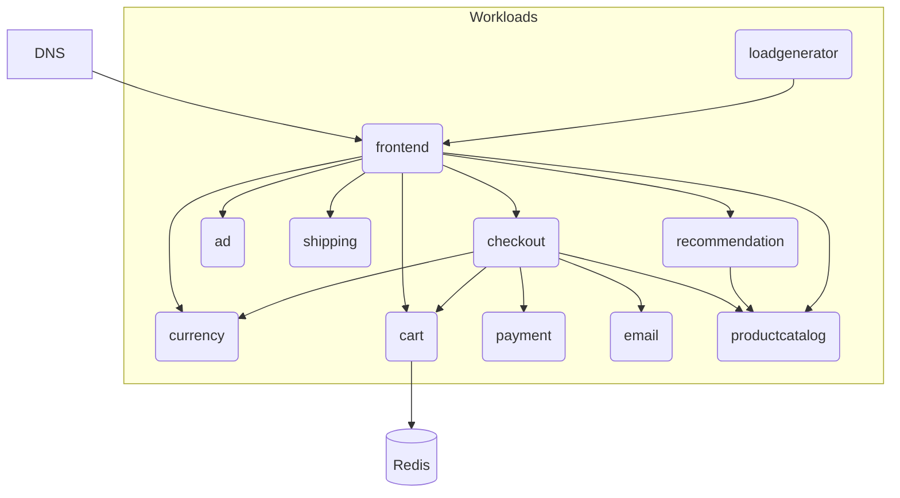

## Overview

In this example we will walk you through how you can deploy eleven containerized applications illustrating the [OnlineBoutique demo](https://github.com/GoogleCloudPlatform/microservices-demo), and this with both `score-compose` and `score-k8s`.



## Score files

We will describe each containerized application with its own Score file for each. The demo code can be found [here](https://github.com/Humanitec-DemoOrg/onlineboutique-demo/tree/main).

Open your IDE and paste in the following `score-frontend.yaml` file, which describes the `frontend` containerized application exposed via a DNS that queries different other applications on each request:

```yaml
apiVersion: score.dev/v1b1
metadata:
  name: frontend
containers:
  frontend:
    image: .
    livenessProbe:
      httpGet:
        path: /_healthz
        port: 8080
        httpHeaders:
        - name: Cookie
          value: shop_session-id=x-liveness-probe
    readinessProbe:
      httpGet:
        path: /_healthz
        port: 8080
        httpHeaders:
        - name: Cookie
          value: shop_session-id=x-readiness-probe
    variables:
      AD_SERVICE_ADDR: "${resources.ad.name}:9555"
      CART_SERVICE_ADDR: "${resources.cart.name}:7070"
      CHECKOUT_SERVICE_ADDR: "${resources.checkout.name}:5050"
      CURRENCY_SERVICE_ADDR: "${resources.currency.name}:7000"
      ENABLE_PROFILER: "0"
      PAYMENT_SERVICE_ADDR: "${resources.payment.name}:50051"
      PORT: "8080"
      PRODUCT_CATALOG_SERVICE_ADDR: "${resources.productcatalog.name}:3550"
      RECOMMENDATION_SERVICE_ADDR: "${resources.recommendation.name}:8080"
      SHIPPING_SERVICE_ADDR: "${resources.shipping.name}:50051"
      SHOPPING_ASSISTANT_SERVICE_ADDR: "not-used-here:8080"
      CYMBAL_BRANDING: "false"
      FRONTEND_MESSAGE: ""
      ENABLE_ASSISTANT: "false"
    resources:
      limits:
        memory: "50Mi"
        cpu: "50m"
      requests:
        memory: "30Mi"
        cpu: "30m"
service:
  ports:
    http:
      port: 8080
      targetPort: 8080
resources:
  dns:
    type: dns
  route:
    type: route
    params:
      host: ${resources.dns.host}
      path: /
      port: 8080
  ad:
    type: service
  cart:
    type: service
  checkout:
    type: service
  currency:
    type: service
  payment:
    type: service
  productcatalog:
    type: service
  recommendation:
    type: service
  shipping:
    type: service
```

The following `score-cart.yaml` file describes the `cart` containerized application talking to a Redis database:

```yaml
apiVersion: score.dev/v1b1
metadata:
  name: cart
containers:
  cart:
    image: .
    variables:
      REDIS_ADDR: "${resources.redis-cart.host}:${resources.redis-cart.port},user=${resources.redis-cart.username},password=${resources.redis-cart.password}"
    resources:
      limits:
        memory: "90Mi"
        cpu: "220m"
      requests:
        memory: "70Mi"
        cpu: "200m"
service:
  ports:
    grpc:
      port: 7070
      targetPort: 7070
resources:
  redis-cart:
    type: redis
```

Just two Score files have been illustrated above, you can grab the other Score files from [this GitHub repository](https://github.com/Humanitec-DemoOrg/onlineboutique-demo/tree/main/apps).

## Deployment with `score-compose` and `score-k8s`

From here, we will now see how to deploy this exact same Score files with either with `score-compose` or with `score-k8s`:






## Next steps

- [**Explore more examples**](/examples/): Check out more examples to dive into further use cases and experiment with different configurations.
- [**Join the Score community**](): Connect with fellow Score developers on our CNCF Slack channel or start find your way to contribute to Score.
