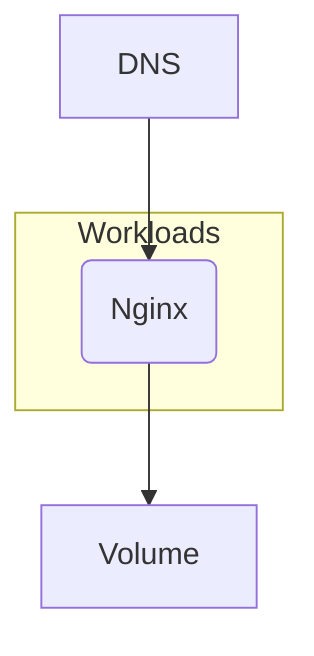

## Overview

In this example we will walk you through how you can deploy an unprivileged containerized Nginx application, and this with both `score-compose` and `score-k8s`.



## Score file

Open your IDE and paste in the following `score.yaml` file, which describes a simple web server exposed via a DNS. The demo code can be found [here](https://github.com/mathieu-benoit/nginx-score-demo).

```yaml
apiVersion: score.dev/v1b1
metadata:
  name: nginx
containers:
  webapp:
    image: .
service:
  ports:
    tcp:
      port: 80
      targetPort: 80
resources:
  dns:
    type: dns
  route:
    type: route
    params:
      host: ${resources.dns.host}
      path: /
      port: 80
```

You can use this Score file with the [`nginx`](https://hub.docker.com/_/nginx) container image. But a more secure approach is to use the [`nginxinc/nginx-unprivileged`](https://hub.docker.com/r/nginxinc/nginx-unprivileged) instead. For this we need to anticipate that our Nginx container will run as unprivileged, exposed on port `8080`, and will need to write some files in the `/tmp` folder as a `volume`:

```yaml
apiVersion: score.dev/v1b1
metadata:
  name: nginx
containers:
  webapp:
    image: .
    volumes:
      /tmp:
        source: ${resources.tmp}
        readOnly: false
service:
  ports:
    tcp:
      port: 8080
      targetPort: 8080
resources:
  tmp:
    type: volume
  dns:
    type: dns
  route:
    type: route
    params:
      host: ${resources.dns.host}
      path: /
      port: 8080
```

We will use this last Score file for the rest of this page.

## Deployment with `score-compose` and `score-k8s`

From here, we will now see how to deploy this exact same Score file with either with `score-compose` or with `score-k8s`:






## Next steps

- [**Explore more examples**](/docs/examples/): Check out more examples to dive into further use cases and experiment with different configurations.
- [**Join the Score community**](): Connect with fellow Score developers on our CNCF Slack channel or start find your way to contribute to Score.
