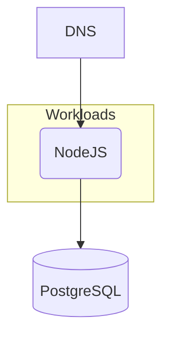

## Overview

In this example we will walk you through how you can deploy a NodeJS containerized application using a PostgreSQL database, and this with both `score-compose` and `score-k8s`.



## 1. `score.yaml`

Open your IDE and paste in the following `score.yaml` file, which describes a simple web server that queries a PostgreSQL database on each request and is exposed via a DNS. The demo code can be found [here](https://github.com/score-spec/sample-score-app).

```yaml
apiVersion: score.dev/v1b1
metadata:
  name: hello-world
containers:
  hello-world:
    image: .
    variables:
      PORT: "3000"
      MESSAGE: "Hello, World!"
      DB_DATABASE: ${resources.db.name}
      DB_USER: ${resources.db.username}
      DB_PASSWORD: ${resources.db.password}
      DB_HOST: ${resources.db.host}
      DB_PORT: ${resources.db.port}
resources:
  db:
    type: postgres
  dns:
    type: dns
  route:
    type: route
    params:
      host: ${resources.dns.host}
      path: /
      port: 8080
service:
  ports:
    www:
      port: 8080
      targetPort: 3000
```

From here, you can deploy this exact same Score file:

- Either with [`score-compose`](#2-score-compose)
- Or with [`score-k8s`](#3-score-k8s)

## 2. `score-compose`

To begin, follow the [installation instructions](/docs/score-implementation/score-compose/installation) to install the latest version of `score-compose`.

### `init`

Initialize your current `score-compose` workspace, run the following command in your terminal:

```bash
score-compose init --no-sample
```

The `init` command will create the `.score-compose` directory with the [default resource provisioners]() available.

You can see the resource provisioners available by running this command:

```bash
score-compose provisioners list
```

The Score file example illustrated uses three resource types: `postgres`, `dns` and `route`.

```none
+---------------+-------+------------------+--------------------------------+---------------------------------+
|     TYPE      | CLASS |      PARAMS      |            OUTPUTS             |          DESCRIPTION            |
+---------------+-------+------------------+--------------------------------+---------------------------------+
| dns           | (any) |                  | host                           | Outputs a *.localhost domain    |
|               |       |                  |                                | as the hostname                 |
+---------------+-------+------------------+--------------------------------+---------------------------------+
| postgres      | (any) |                  | database, host, name,          | Provisions a dedicated          |
|               |       |                  | password, port, username       | database on a shared PostgreSQL |
|               |       |                  |                                | instance                        |
+---------------+-------+------------------+--------------------------------+---------------------------------+
| route         | (any) | host, path, port |                                | Provisions an Ingress route on  |
|               |       |                  |                                | a shared Nginx instance         |
+---------------+-------+------------------+--------------------------------+---------------------------------+
```

### `generate`

Convert the `score.yaml` file into a runnable `compose.yaml`, run the following command in your terminal:

```bash
score-compose generate score.yaml --image ghcr.io/score-spec/sample-score-app:latest
```

The `generate` command will add the input `score.yaml` workload with a particular container image to the `.score-compose/state.yaml` state file and generate the output `compose.yaml`.

If you want to build the container image when this `compose.yaml` will be deployed, you can run this `generate` command with the `--build` parameter instead:

```bash
score-compose generate score.yaml --build 'main={"context":".","tags":["sample-score-app:local"]}'
```

See the generated `compose.yaml` by running this command:

```bash
cat compose.yaml
```

If you make any modifications to the `score.yaml` file, run `score-compose generate score.yaml` to regenerate the output `compose.yaml`.

### `resources`

Get the information of the resources dependencies of the workload, run the following command:

```bash
score-compose resources list
```

```none
+---------------------------------+--------------------------------+
|               UID               |            OUTPUTS             |
+---------------------------------+--------------------------------+
| dns.default#hello-world.dns     | host                           |
+---------------------------------+--------------------------------+
| postgres.default#hello-world.db | database, host, name,          |
|                                 | password, port, username       |
+---------------------------------+--------------------------------+
| route.default#hello-world.route |                                |
+---------------------------------+--------------------------------+
```

At this stage, we can already see the value of the `dns` resource generated:

```bash
score-compose resources get-outputs dns.default#hello-world.dns --format '{{ .host }}'
```

```none
dnsbcsqnd.localhost
```

Same for the `postgres` resource:

```bash
score-compose resources get-outputs postgres.default#hello-world.db
```

```none
{
  "database": "db-cHqToKGM",
  "host": "pg-l1fFqm",
  "name": "db-cHqToKGM",
  "password": "REDACTED",
  "port": 5432,
  "username": "REDACTED"
}
```

### `docker compose`

Run `docker compose up` to execute the generated `compose.yaml` file:

```bash
docker compose up -d
```

```none
[+] Running 7/7
 ✔ Network nodejs_default                      Created 
 ✔ Volume "nodejs_pg-Tut8g7-data"              Created
 ✔ Container nodejs-pg-Tut8g7-1                Healthy 
 ✔ Container nodejs-routing-CzbPM2-1           Started 
 ✔ Container nodejs-pg-Tut8g7-init-1           Exited
 ✔ Container nodejs-wait-for-resources-1       Exited 
 ✔ Container nodejs-hello-world-hello-world-1  Started
```

### `docker ps`

See the running containers:

```bash
docker ps
```

```none
CONTAINER ID   IMAGE                                        COMMAND                  CREATED          STATUS                    PORTS                                     NAMES
8488aa2fe204   ghcr.io/score-spec/sample-score-app:latest   "node index.js"          17 minutes ago   Up 17 minutes             3000/tcp                                  nodejs-hello-world-hello-world-1
22c78e726612   mirror.gcr.io/nginx:1-alpine                 "/docker-entrypoint.…"   17 minutes ago   Up 17 minutes             0.0.0.0:8080->80/tcp, [::]:8080->80/tcp   nodejs-routing-CzbPM2-1
01cc858a6162   mirror.gcr.io/postgres:17-alpine             "docker-entrypoint.s…"   17 minutes ago   Up 17 minutes (healthy)   5432/tcp                                  nodejs-pg-Tut8g7-1
```

### `curl localhost:8080`

Test the running container, run the following command:

```bash
curl localhost:8080 -H "Host: dnsbcsqnd.localhost"
```

```none
Hello, World!
This is an application talking to a PostgreSQL 17.5 database on host pg-Tut8g7, deployed with Score!
PostgreSQL 17.5 on x86_64-pc-linux-musl, compiled by gcc (Alpine 14.2.0) 14.2.0, 64-bit
```

Congrats! You’ve successfully deploy, with the `score-compose` implementation, a sample NodeJS containerized workload talking to PostgreSQL and exposed via a DNS. You provisioned them through Docker, without writing the Docker Compose file by yourself.

## 3. `score-k8s`

To begin, follow the [installation instructions](/docs/score-implementation/score-k8s/installation) to install the latest version of `score-k8s`.

### `init`

Initialize your current `score-k8s` workspace, run the following command in your terminal:

```bash
score-k8s init --no-sample
```

The `init` command will create the `.score-k8s` directory with the [default resource provisioners]() available.

You can see the resource provisioners available by running this command:

```bash
score-k8s provisioners list
```

The Score file example illustrated uses three resource types: `postgres`, `dns` and `route`.

```none
+---------------+-------+------------------+--------------------------------+---------------------------------+
|     TYPE      | CLASS |      PARAMS      |            OUTPUTS             |          DESCRIPTION            |
+---------------+-------+------------------+--------------------------------+---------------------------------+
| dns           | (any) |                  | host                           | Outputs a *.localhost domain    |
|               |       |                  |                                | as the hostname                 |
+---------------+-------+------------------+--------------------------------+---------------------------------+
| postgres      | (any) |                  | database, host, name,          | Provisions a dedicated          |
|               |       |                  | password, port, username       | database on a shared PostgreSQL |
|               |       |                  |                                | instance                        |
+---------------+-------+------------------+--------------------------------+---------------------------------+
| route         | (any) | host, path, port |                                | Provisions an Ingress route on  |
|               |       |                  |                                | a shared Nginx instance         |
+---------------+-------+------------------+--------------------------------+---------------------------------+
```

### `generate`

Convert the `score.yaml` file into a runnable `manifests.yaml`, run the following command in your terminal:

```bash
score-k8s generate score.yaml --image ghcr.io/score-spec/sample-score-app:latest
```

The `generate` command will add the input `score.yaml` workload with a particular container image to the `.score-k8s/state.yaml` state file and generate the output `manifests.yaml`.

See the generated `manifests.yaml` by running this command:

```bash
cat manifests.yaml
```

If you make any modifications to the `score.yaml` file, run `score-k8s generate score.yaml` to regenerate the output `manifests.yaml`.

### `resources`

Get the information of the resources dependencies of the workload, run the following command:

```bash
score-k8s resources list
```

```none
+---------------------------------+--------------------------------+
|               UID               |            OUTPUTS             |
+---------------------------------+--------------------------------+
| dns.default#hello-world.dns     | host                           |
+---------------------------------+--------------------------------+
| postgres.default#hello-world.db | database, host, name,          |
|                                 | password, port, username       |
+---------------------------------+--------------------------------+
| route.default#hello-world.route |                                |
+---------------------------------+--------------------------------+
```

At this stage, we can already see the value of the `dns` resource generated:

```bash
score-k8s resources get-outputs dns.default#hello-world.dns --format '{{ .host }}'
```

```none
dnsgm0shc.localhost
```

Same for the `postgres` resource:

```bash
score-k8s resources get-outputs postgres.default#hello-world.db
```

```none
{
  "database": "db-QnPWyXNB",
  "host": "pg-Tut8g7",
  "name": "db-QnPWyXNB",
  "password": "REDACTED",
  "port": 5432,
  "username": "REDACTED"
}
```

### `kubectl apply`

_Here you will need to have access to a Kubernetes cluster to execute the following commands. You can follow [these instructions](/docs/how-to/score-k8s/kind-cluster/) if you want to set up a Kind cluster._

Run `kubectl apply` to execute the generated `manifests.yaml` file:

```bash
kubectl apply -f manifests.yaml
```

```none
secret/pg-hello-world-87af7a15 created
statefulset.apps/pg-hello-world-87af7a15 created
service/pg-hello-world-87af7a15 created
httproute.gateway.networking.k8s.io/route-hello-world-4b82945e created
service/hello-world created
deployment.apps/hello-world created
```

### `kubectl get all`

See the running containers:

```bash
kubectl get all
```

```none
NAME                               READY   STATUS    RESTARTS      AGE
pod/hello-world-68cd6f7968-26fh8   1/1     Running   2 (31s ago)   37s
pod/pg-hello-world-87af7a15-0      1/1     Running   0             37s

NAME                              TYPE        CLUSTER-IP      EXTERNAL-IP   PORT(S)    AGE
service/hello-world               ClusterIP   10.96.250.192   <none>        8080/TCP   37s
service/pg-hello-world-87af7a15   ClusterIP   10.96.231.3     <none>        5432/TCP   37s

NAME                          READY   UP-TO-DATE   AVAILABLE   AGE
deployment.apps/hello-world   1/1     1            1           37s

NAME                                     DESIRED   CURRENT   READY   AGE
replicaset.apps/hello-world-68cd6f7968   1         1         1       37s

NAME                                       READY   AGE
statefulset.apps/pg-hello-world-87af7a15   1/1     37s
```

### `curl localhost`

Test the running container, run the following command:

```bash
curl localhost -H "Host: dnsgm0shc.localhost"
```

```none
Hello, World!
This is an application talking to a PostgreSQL 17.5 database on host pg-Tut8g7, deployed with Score!
PostgreSQL 17.5 on x86_64-pc-linux-musl, compiled by gcc (Alpine 14.2.0) 14.2.0, 64-bit
```

Congrats! You’ve successfully deploy, with the `score-k8s` implementation, a sample NodeJS containerized workload talking to PostgreSQL and exposed via a DNS. You provisioned them through `kubectl`, without writing the Kubernetes manifests file by yourself.

## Next steps

- [**Explore more examples**](/docs/examples/): Check out more examples to dive into further use cases and experiment with different configurations.
- [**Join the Score community**](): Connect with fellow Score developers on our CNCF Slack channel or start find your way to contribute to Score.
