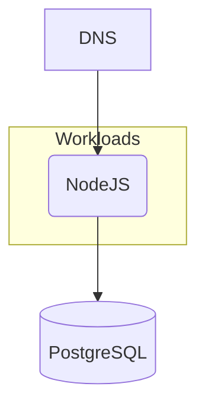

## Overview

In this example we will walk you through how you can deploy a containerized NodeJS application using a PostgreSQL database, and this with both `score-compose` and `score-k8s`.



## Score file

Open your IDE and paste in the following `score.yaml` file, which describes a simple web server exposed via a DNS that queries a PostgreSQL database on each request. The demo code can be found [here](https://github.com/score-spec/sample-score-app).

```yaml
apiVersion: score.dev/v1b1
metadata:
  name: hello-world
containers:
  hello-world:
    image: .
    variables:
      PORT: "3000"
      MESSAGE: "Hello, World!"
      DB_DATABASE: ${resources.db.name}
      DB_USER: ${resources.db.username}
      DB_PASSWORD: ${resources.db.password}
      DB_HOST: ${resources.db.host}
      DB_PORT: ${resources.db.port}
service:
  ports:
    www:
      port: 8080
      targetPort: 3000
resources:
  db:
    type: postgres
  dns:
    type: dns
  route:
    type: route
    params:
      host: ${resources.dns.host}
      path: /
      port: 8080
```

## Deployment with `score-compose` and `score-k8s`

From here, we will now see how to deploy this exact same Score file with either with `score-compose` or with `score-k8s`:






## Next steps

- [**Explore more examples**](/docs/examples/): Check out more examples to dive into further use cases and experiment with different configurations.
- [**Join the Score community**](): Connect with fellow Score developers on our CNCF Slack channel or start find your way to contribute to Score.
